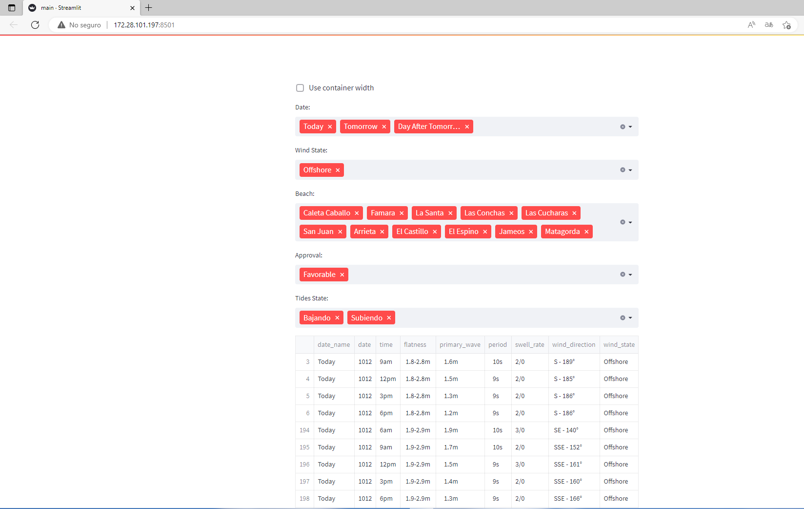

# 🌊 MAGICSEAWEED
 > **_NOTE:_**  <h3>I'm struggling with the deployment on Streamlit Cloud, you are welcome to help me if you want.</h3>

Automation script that helps me in the task of interpreting when there are waves, scraping data from multiple magicseaweed sites (with threads) from the spots at the same time.

# 🏄 steps to put this to work:

Asure you have selenium and google chrome installed on your linux machine.

1. ```git clone this repo```
2. ```cd to folder```
3. ```python -m venv venv```
4. ```source venv/bin/activate```
5. ```pip install -r requirements.txt```
6. ```streamlit run main.py```
7. Open the network url and wait for it to load



Personally, the conditions that I consider favorables are the following: The wind_state parameter, I want it to be off-shore, additionally I look that the period is higher than 7s and strength is greater than 1m and less than ~2.5.
I also see that flatness parameter is not flat and that is higher than primary waves.
Another thing to take notice is that I only take three days (today, tomorrow and day after tomorrow), because the more far you go on days, the less accurate it are the predictions.

This project is still under construction (I'm struggling with the deployment in Streamlit)

If you enjoyed this project, I will be so much pleased if you give me a star (⭐).
